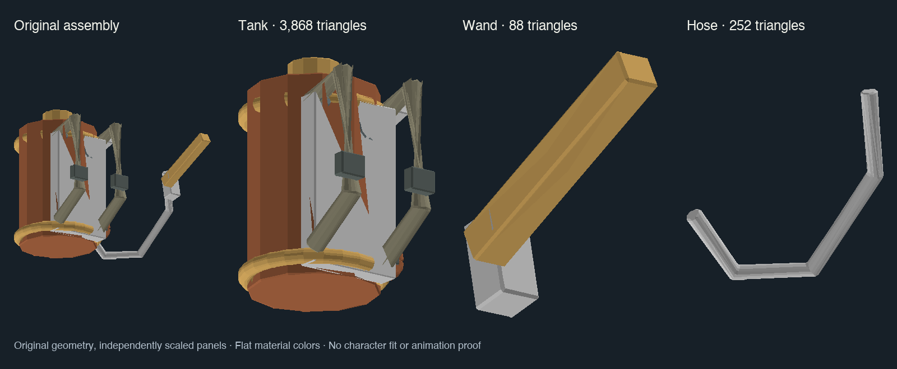

# Warden attachment source parts

`WardenTank.glb`, `WardenWand.glb` and `WardenHose.glb` partition the original
`../WardenSprayer.glb`. The original GLB, Blender scene, coat, helmet and all
shipping timbermesh copies are unchanged. These are source assets, not player
payload or completed wearables.

Regenerate from the repo root with:

```sh
python3 scripts/art/split_warden_sprayer.py
```

The script retains original node transforms and copies referenced binary buffer
views byte-for-byte. It prunes unused mesh/material/texture resources, requires
all 23 mesh objects to belong to exactly one group, and verifies all 4,208 source
triangles remain: tank 3,868; wand/grip 88; hose 252. `provenance.json` records the
exact source/output hashes and object membership. It intentionally fails when
unsupported source structure or membership changes, rather than silently losing
newly authored details. Original glTF materials remain for art review; native
exports must use the existing Ironteeth material mapping (including the shipping
BaseMetal.IronTeeth remap), without adding an atlas.



The preview was rendered from the GLB geometry with flat material colors; panels
are independently scaled. It verifies the split visually, not character fit,
native materials, wearability or animation.

## Attachment and fitting recipe

| Part | Native anchor | Fit and visibility work |
|---|---|---|
| Existing WardenHelmet | `#Head` | Create a head-local wrapper pivot, preserve mesh origin inside it, then fit ears/eyes/crown on an adult Ironteeth model. Helmet is not fitted yet. |
| WardenTank | `#Backpack` | Fit backplate against the back and straps around shoulders; check tank/tail clearance. Keep tank through an empty return journey rather than equating its visibility with water stock. |
| WardenWand | `#CarriedInHands` | Put a wrapper pivot at the grip, define a nozzle transform at the wand tip, and fit against the native hand pose. Stow/hide during ordinary hauling; show only in response phases that own the hands. |
| WardenHose | Endpoint references | Preserve this original hose as source and a static comparison. It cannot follow both hand and backpack as a rigid child. Use tank outlet and wand inlet transforms for a small procedural tube, or separately author a stowed transit pose. |

Do not bake guessed character offsets into these source files. Wrappers should
hold fitting corrections, so source geometry remains comparable and reversible.
Native model hooks are verified; numeric fit, handedness, spray direction and
movement clearance require an actual adult character preview. The current
sprayer is approximately 0.82 units high in the native preview; dimensions alone
do not prove it fits a beaver. No wearable colliders are needed for rendering.

## Prefab provisioning: native optimizer prototype

Installed 1.1.2.4 IL provides a smaller possible route than an extra mesh bundle:

1. `TemplateAttachments.GetOrCreateAttachment` obtains an `AssetRef<GameObject>`
   prefab and invokes `OptimizedPrefabInstantiator.Instantiate`.
2. That method calls `IPrefabOptimizationChain.Process(GameObject)` first.
3. `TimbermeshPrefabOptimizer` finds `TimbermeshDescription` components, loads
   their named models as `BinaryData`, and passes them to `TimbermeshImporter`.
4. `TimbermeshSpecConverter` itself creates this same description component and
   calls `SetModelName`.

The staged Warden-only `IAssetProvider` supplies cached
GameObjects containing `TimbermeshDescription` for explicit attachment prefab
IDs; the native optimizer can load our shipped model and native materials.
It returns false for unrecognized paths/types, keeps model data in the existing
file provider, and destroys only its own description objects on Reset. A separate
Bootstrapper configurator matches the native asset-loader lifetime; the Game
configurator is too late. The isolated licensed Unity probe validates wrapper
construction, normalized lookup, cache/reset and native geometry import; the
full game optimizer, materials and attachment fit remain unverified. See
[the probe instructions](../../../scripts/qa/warden-attachments/README.md) for the reproducible probe.

Fallback: a small platform prefab bundle built with the existing
`src/Wildfire.Unity/UnityBatchmodeProject/Assets/Editor` pipeline can contain native
`TimbermeshDescription` wrappers. Resolve installed game assemblies at build time;
do not package them, native character assets, or reference textures. A wrapper
must remain attached to the actual native assembly/component identity in the
player. Unity can prove bundle structure, but only the game proves its import
and entity material/highlight behavior. Avoid substituting fake native component
stubs just to make an editor build pass.

The three split source parts now have native timbermesh exports under
`src/Wildfire.Timberborn/Data/Equipment/FireResponse`, generated with
`scripts/art/export_warden_attachments.py` and the existing native-material
mapping. The export retains source origins and creates no new atlas. A split-source
GLB is not a GameObject prefab and is not directly usable
as `AttachmentDefinition.Prefab`.

The next acceptance step is one helmet: native creation, employment/duty
show-hide, ordinary carrying, character hiding/death, save/reload and movement.
Then tank/wand/hose. Clothing direction remains a separate pending decision.
